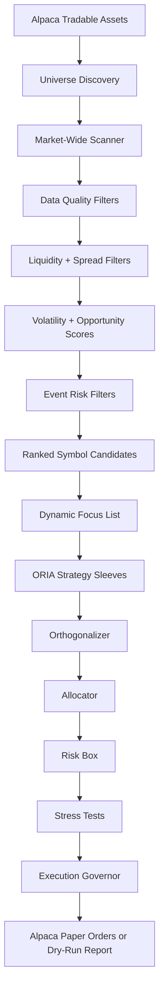

# Dynamic Market Universe

The daytrader does not require a fixed ticker list. Optional seed symbols can
be supplied, but the normal flow discovers tradable assets, scans them, rejects
poor candidates, ranks the survivors, and sends only a compact focus list into
the ORIA quant pipeline.



## How It Works

`UniverseDiscoveryEngine` asks Alpaca for tradable assets when credentials are
available. In dry-run or offline development, it uses a broad fallback asset
set and still applies the same scan/filter/rank process. Asset metadata is
cached under `data/universe` to avoid repeated expensive API calls.

`MarketScanner` scores each symbol for data quality, liquidity, spread,
volatility, momentum, mean reversion, breakout behavior, event risk, and
execution quality. It rejects symbols with stale or bad data, low liquidity,
wide spreads, unacceptable volatility, or invalid prices.

`FocusListManager` combines current holdings, optional seeds, semantic flags,
and the highest ranked valid candidates into a bounded focus list. That list is
what ORIA analyzes deeply.

## Commands

Run this before a quant pass to see which symbols the system would consider:

```bash
python -m tradingagents.alpaca_daytrader universe-scan
python -m tradingagents.alpaca_daytrader universe-report
```

Universe reports are written to `reports/universe/YYYY-MM-DD.md`.

Useful environment settings:

```env
UNIVERSE_MAX_SCAN_SYMBOLS=3000
UNIVERSE_MAX_FOCUS_SYMBOLS=25
UNIVERSE_SEED_SYMBOLS=
UNIVERSE_EXCLUDED_SYMBOLS=
UNIVERSE_MIN_PRICE=2.0
UNIVERSE_MAX_PRICE=1000.0
UNIVERSE_MIN_INTRADAY_VOLUME=100000
UNIVERSE_MAX_SPREAD_BPS=30
UNIVERSE_MIN_ATR_PCT=0.005
UNIVERSE_MAX_ATR_PCT=0.12
```

For a faster development scan:

```bash
UNIVERSE_MAX_SCAN_SYMBOLS=100 UNIVERSE_MAX_FOCUS_SYMBOLS=10 \
python -m tradingagents.alpaca_daytrader universe-scan
```

If the focus list is empty, lower the scan constraints only for research, then
inspect the rejection breakdown in the universe report.
