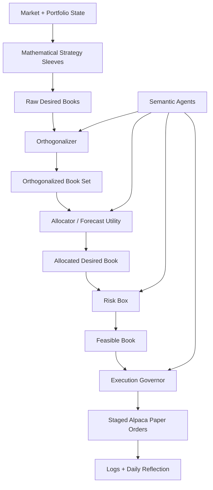

# ORIA-Inspired Quant Pipeline

ORIA means Orthogonal Risk Integrated Alpha in this project. It is an internal,
custom mathematical architecture for research and Alpaca paper trading. It is
not an official package and does not guarantee profit.



## Architecture

Dynamic universe discovery now runs before ORIA, so the quant pipeline does not
require hardcoded tickers. The system discovers tradable assets, scans for data
quality/liquidity/spread/volatility/opportunity, builds a focus list, and only
then runs the strategy sleeves.

Strategy sleeves produce raw desired books. The initial sleeves are momentum,
mean reversion, volatility breakout, optional pair spread, minimum variance,
and cash/no-trade.

The orthogonalizer aligns symbols, removes approximate factor exposure, and
decorrelates sleeves with a covariance-aware inner product. The allocator then
scores each sleeve using edge, uncertainty, cost, turnover, and risk penalties.

The RiskBox enforces hard constraints such as market hours, max gross/net
exposure, max position weight, daily loss, drawdown, spread, liquidity, and
no-trade symbols. The ExecutionGovernor converts the feasible book into staged
order plans and defaults to limit orders.

Semantic review agents produce structured audit notes for raw signals,
orthogonalization, allocation, risk, and execution. They explain and flag; hard
risk constraints are enforced by deterministic code.

## Commands

Recommended operating sequence:

```bash
pip install -e .
python -m tradingagents.alpaca_daytrader quant-diagnostics
python -m tradingagents.alpaca_daytrader universe-scan
python -m tradingagents.alpaca_daytrader quant-once --dry-run
python -m tradingagents.alpaca_daytrader quant-report
```

Available quant commands:

```bash
python -m tradingagents.alpaca_daytrader quant-once --dry-run
python -m tradingagents.alpaca_daytrader quant-once --review
python -m tradingagents.alpaca_daytrader quant-run --dry-run
python -m tradingagents.alpaca_daytrader quant-run --shadow
python -m tradingagents.alpaca_daytrader quant-once --execute
python -m tradingagents.alpaca_daytrader quant-report
python -m tradingagents.alpaca_daytrader quant-backtest --symbols AAPL,MSFT,NVDA --periods 180
python -m tradingagents.alpaca_daytrader quant-walkforward --train-days 60 --test-days 10
python -m tradingagents.alpaca_daytrader quant-diagnostics
```

Mode meanings:

- `--dry-run`: one analysis pass, no paper orders submitted.
- `--review`: asks for human approval before paper execution.
- `--shadow`: continuous simulated operation, no order submission.
- `--execute`: automatic Alpaca paper execution after code risk checks.

Use `--iterations` with `quant-run` while testing:

```bash
python -m tradingagents.alpaca_daytrader quant-run --shadow --iterations 5
```

## Safety

Dry-run is the default. Alpaca execution is paper-only by default and uses
environment variables, never hardcoded credentials. Live trading is refused
unless `ALLOW_LIVE_TRADING=true`; the provided Alpaca adapter still initializes
paper trading with `TradingClient(api_key, secret_key, paper=True)`.

## Logs

Quant logs are written to:

- `logs/quant/raw_books/YYYY-MM-DD.jsonl`
- `logs/quant/orthogonalization/YYYY-MM-DD.jsonl`
- `logs/quant/allocation/YYYY-MM-DD.jsonl`
- `logs/quant/risk/YYYY-MM-DD.jsonl`
- `logs/quant/execution/YYYY-MM-DD.jsonl`
- `reports/quant/YYYY-MM-DD.md`
- `reports/quant/backtests/<timestamp>.md`

Read the Markdown report first. The JSONL logs are better for debugging exact
stage payloads and experiment reproducibility.
